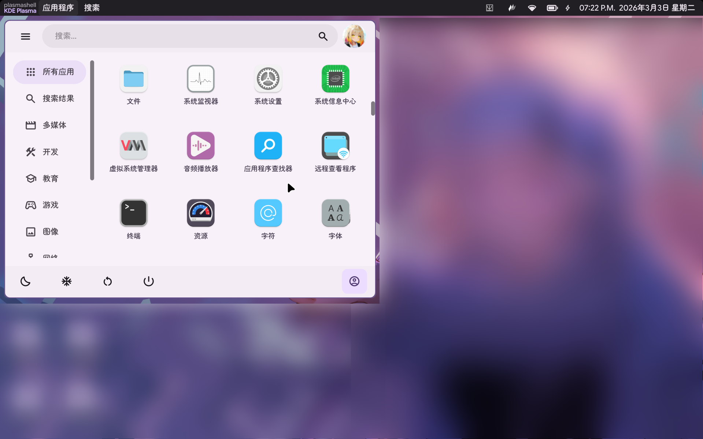

<!-- Improved compatibility of back to top link: See: https://github.com/othneildrew/Best-README-Template/pull/73 -->
<a id="readme-top"></a>
<!--
*** Thanks for checking out the Best-README-Template. If you have a suggestion
*** that would make this better, please fork the repo and create a pull request
*** or simply open an issue with the tag "enhancement".
*** Don't forget to give the project a star!
*** Thanks again! Now go create something AMAZING! :D
-->


<!-- PROJECT SHIELDS -->
<!--
*** I'm using markdown "reference style" links for readability.
*** Reference links are enclosed in brackets [ ] instead of parentheses ( ).
*** See the bottom of this document for the declaration of the reference variables
*** for contributors-url, forks-url, etc. This is an optional, concise syntax you may use.
*** https://www.markdownguide.org/basic-syntax/#reference-style-links
-->
    


<!-- PROJECT LOGO -->
<br />
<div align="center">
  <!--
  <a href="https://github.com/github_username/repo_name">
    
  </a>
  -->

<h3 align="center">Husky Panel</h3>

  <p align="center">
    (WIP) Yet another bar for Linux on Wayland session...
    <br />
    <!--
    <a style="display: none;" href="https://github.com/github_username/repo_name"><strong>Explore the docs »</strong></a>
    -->
    
    <br />
    <br />
    <!--
    <a style="display: none;"  href="https://github.com/github_username/repo_name">View Demo</a>
    <span style="display: none;" >&middot;</span>
    <a style="display: none;"  href="https://github.com/github_username/repo_name/issues/new?labels=bug&template=bug-report---.md">Report Bug</a>
    <span style="display: none;" >&middot;</span>
    <a style="display: none;"  href="https://github.com/github_username/repo_name/issues/new?labels=enhancement&template=feature-request---.md">Request Feature</a>
    -->
  </p>
</div>


<!-- TABLE OF CONTENTS -->
<details>
  <summary>Table of Contents</summary>
  <ol>
    <li>
      <a href="#about-the-project">About The Project</a>
      <ul>
        <li><a href="#built-with">Built With</a></li>
      </ul>
    </li>
    <li>
      <a href="#getting-started">Getting Started</a>
      <ul>
        <li><a href="#prerequisites">Prerequisites</a></li>
        <li><a href="#installation">Installation</a></li>
      </ul>
    </li>
    <li><a href="#usage">Usage</a></li>
    <li><a href="#roadmap">Roadmap</a></li>
    <li><a href="#contributing">Contributing</a></li>
    <li><a href="#license">License</a></li>
    <li><a href="#contact">Contact</a></li>
    <li><a href="#acknowledgments">Acknowledgments</a></li>
  </ol>
</details>


<!-- ABOUT THE PROJECT -->
## About The Project
`HuskyPanel` is another shell bar panel for Linux Wayland session. This is an experimental project that trys to utilize QWidget to bring a Material design 3 styled UI to your desktop environment.

Currenty we are focusing on KWin/KDE Plasma.

<p align="right">(<a href="#readme-top">back to top</a>)</p>


### Built With
* Qt 6.5+
* Layer-Shell-Qt
* Abseil
* Google Test
* Libdbusmenu
* Material-Color-Utilities
* QWindowKit

<p align="right">(<a href="#readme-top">back to top</a>)</p>


<!-- GETTING STARTED -->
## Getting Started
Ensure that you have Qt version 6.5+ avaliable in your system. This bar uses a new API provided by Qt 6.5+ to aware the change in light/dark scheme. Without the proper version of Qt, the bar could NOT be complied.

Currently only Plasma 6 is supported, we recommend you to login a Plasma 6.5 session to use this bar. Wlroots WM support is planned.

### Prerequisites
You will need to install the dependencies.

On OpenSUSE: 
```bash
sudo zypper in wayland-devel \
  wayland-protocols-devel \
  kf6-extra-cmake-modules \
  libxkbcommon-devel
```

On Archlinux: 
```bash
sudo pacman -S wayland wayland-protocols extra-cmake-modules libxkbcommon
```

You will also need to use a Wayland session, otherwise the bar will NOT attach properly to the top of the screen.

Other third-party libraries has been vendored, so you do NOT need to install them.

### Installation
#### Build the Bar Itself & The Locale Files
```bash
mkdir build
cd build
cmake -D CMAKE_BUILD_TYPE=Release ..
cd ..
```

#### Copy the Locale Files
Copy `build/locales/HuskyPanel_zh_CN.qm` to `res/translations/HuskyPanel_zh_CN.qm`.

Then, you will need to re-compile the bar.
```bash
rm -rf build
mkdir build
cd build
cmake -D CMAKE_BUILD_TYPE=Release ..
cd ..
```

#### (KWin Only) Install the Plugin
Before installing, do read the README on `plugins/kde/app-bridge`.

```bash
cd ./plugins/kde/app-bridge/
chmod a+x ./install.sh
./install.sh
```

(To uninstall the plugin, please execute: )
```bash
cd ./plugins/kde/app-bridge/
chmod a+x ./uninstall.sh
./uninstall.sh
```

<p align="right">(<a href="#readme-top">back to top</a>)</p>


<!-- USAGE EXAMPLES -->
## Usage
(*Documentation work in progress...*)

<p align="right">(<a href="#readme-top">back to top</a>)</p>


<!-- ROADMAP -->
## Roadmap

- [X] Search bar
- [X] Clock
- [ ] System tray
    - [X] Simple tray
    - [ ] Icon folding
- [ ] App indicator
    - [X] KWin support (via KWin script)
    - [ ] Niri/Hyprland support
- [ ] Notification manager
- [ ] Network manager
- [ ] Battery manager
- [ ] Volume manager
- [ ] Bluetooth manager
- [ ] App drawer

See the [open issues](https://github.com/github_username/repo_name/issues) for a full list of proposed features (and known issues).

<p align="right">(<a href="#readme-top">back to top</a>)</p>


<!-- CONTRIBUTING -->
## Contributing
Please read [CONTRIBUTING.md](CONTRIBUTING.md).

<p align="right">(<a href="#readme-top">back to top</a>)</p>

### Top contributors:

<a href="https://github.com/github_username/MarcusPy827/Husky-Panel/contributors">
  
</a>


<!-- LICENSE -->
## License

Distributed under the GNU GENERAL PUBLIC LICENSE Version 3. See `COPYING` for more information.

For all the vendored libraries' version, please read `lib/3rdparty/VERSION.md`.

<p align="right">(<a href="#readme-top">back to top</a>)</p>


<!-- CONTACT -->
## Contact
To contact me, please utilize the issue.

<p align="right">(<a href="#readme-top">back to top</a>)</p>


<!-- ACKNOWLEDGMENTS -->
## Acknowledgments
* [Best-README-Template](https://github.com/othneildrew/Best-README-Template.git)
* [LXQt-Panel](https://github.com/lxqt/lxqt-panel.git)
* All the author of the libraries we depended (see [HERE](./lib/3rdparty/VERSION.md) for a detailed list!)

<p align="right">(<a href="#readme-top">back to top</a>)</p>


<!-- MARKDOWN LINKS & IMAGES -->
<!-- https://www.markdownguide.org/basic-syntax/#reference-style-links -->
[contributors-shield]: https://img.shields.io/github/contributors/github_username/repo_name.svg?style=for-the-badge
[contributors-url]: https://github.com/github_username/repo_name/graphs/contributors
[forks-shield]: https://img.shields.io/github/forks/github_username/repo_name.svg?style=for-the-badge
[forks-url]: https://github.com/github_username/repo_name/network/members
[stars-shield]: https://img.shields.io/github/stars/github_username/repo_name.svg?style=for-the-badge
[stars-url]: https://github.com/github_username/repo_name/stargazers
[issues-shield]: https://img.shields.io/github/issues/github_username/repo_name.svg?style=for-the-badge
[issues-url]: https://github.com/github_username/repo_name/issues
[license-shield]: https://img.shields.io/github/license/github_username/repo_name.svg?style=for-the-badge
[license-url]: https://github.com/github_username/repo_name/blob/master/LICENSE.txt
[linkedin-shield]: https://img.shields.io/badge/-LinkedIn-black.svg?style=for-the-badge&logo=linkedin&colorB=555
[linkedin-url]: https://linkedin.com/in/linkedin_username
[product-screenshot]: images/screenshot.png
<!-- Shields.io badges. You can a comprehensive list with many more badges at: https://github.com/inttter/md-badges -->
[Next.js]: https://img.shields.io/badge/next.js-000000?style=for-the-badge&logo=nextdotjs&logoColor=white
[Next-url]: https://nextjs.org/
[React.js]: https://img.shields.io/badge/React-20232A?style=for-the-badge&logo=react&logoColor=61DAFB
[React-url]: https://reactjs.org/
[Vue.js]: https://img.shields.io/badge/Vue.js-35495E?style=for-the-badge&logo=vuedotjs&logoColor=4FC08D
[Vue-url]: https://vuejs.org/
[Angular.io]: https://img.shields.io/badge/Angular-DD0031?style=for-the-badge&logo=angular&logoColor=white
[Angular-url]: https://angular.io/
[Svelte.dev]: https://img.shields.io/badge/Svelte-4A4A55?style=for-the-badge&logo=svelte&logoColor=FF3E00
[Svelte-url]: https://svelte.dev/
[Laravel.com]: https://img.shields.io/badge/Laravel-FF2D20?style=for-the-badge&logo=laravel&logoColor=white
[Laravel-url]: https://laravel.com
[Bootstrap.com]: https://img.shields.io/badge/Bootstrap-563D7C?style=for-the-badge&logo=bootstrap&logoColor=white
[Bootstrap-url]: https://getbootstrap.com
[JQuery.com]: https://img.shields.io/badge/jQuery-0769AD?style=for-the-badge&logo=jquery&logoColor=white
[JQuery-url]: https://jquery.com 