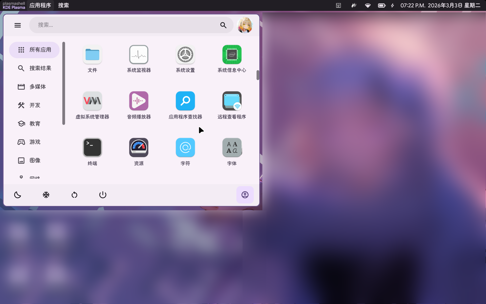

简体中文 | [English](./README.md)

VERSION 0.9.3

<!-- Improved compatibility of back to top link: See: https://github.com/othneildrew/Best-README-Template/pull/73 -->
<a id="readme-top"></a>
<!--
*** Thanks for checking out the Best-README-Template. If you have a suggestion
*** that would make this better, please fork the repo and create a pull request
*** or simply open an issue with the tag "enhancement".
*** Don't forget to give the project a star!
*** Thanks again! Now go create something AMAZING! :D
-->


<!-- PROJECT SHIELDS -->
<!--
*** I'm using markdown "reference style" links for readability.
*** Reference links are enclosed in brackets [ ] instead of parentheses ( ).
*** See the bottom of this document for the declaration of the reference variables
*** for contributors-url, forks-url, etc. This is an optional, concise syntax you may use.
*** https://www.markdownguide.org/basic-syntax/#reference-style-links
-->
    


<!-- PROJECT LOGO -->
<br />
<div align="center">
  <!--
  <a href="https://github.com/github_username/repo_name">
    
  </a>
  -->

<h3 align="center">Husky Panel</h3>

  <p align="center">
    [正在施工中] Linux Wayland会话下又一个状态栏...
    <br />
    <!--
    <a style="display: none;" href="https://github.com/github_username/repo_name"><strong>Explore the docs »</strong></a>
    -->
    
    <span>(<i>截图中图标来自 <a href="https://github.com/vinceliuice/Colloid-icon-theme.git">Colloid Icon Theme</a>，仅供展示，与本项目无关，相关内容不包含在本项目中。</i>)</span>
    <br />
    <br />
    <!--
    <a style="display: none;"  href="https://github.com/github_username/repo_name">View Demo</a>
    <span style="display: none;" >&middot;</span>
    <a style="display: none;"  href="https://github.com/github_username/repo_name/issues/new?labels=bug&template=bug-report---.md">Report Bug</a>
    <span style="display: none;" >&middot;</span>
    <a style="display: none;"  href="https://github.com/github_username/repo_name/issues/new?labels=enhancement&template=feature-request---.md">Request Feature</a>
    -->
  </p>
</div>


<!-- TABLE OF CONTENTS -->
<details>
  <summary>目录</summary>
  <ol>
    <li>
      <a href="#关于项目">关于项目</a>
      <ul>
        <li><a href="#依赖">依赖</a></li>
      </ul>
    </li>
    <li>
      <a href="#快速上手">快速上手</a>
      <ul>
        <li><a href="#前置条件">前置条件</a></li>
        <li><a href="#安装">安装</a></li>
      </ul>
    </li>
    <li><a href="#如何使用">如何使用</a></li>
    <li><a href="#里程碑">里程碑</a></li>
    <li><a href="#贡献者">贡献者</a></li>
    <li><a href="#许可证">许可证</a></li>
    <li><a href="#联系我们">联系我们</a></li>
    <li><a href="#特别鸣谢">特别鸣谢</a></li>
  </ol>
</details>


<!-- ABOUT THE PROJECT -->
## 关于项目
`HuskyPanel`是又一款Linux Wayland会话上的Shell状态栏，这是一个尝试使用QWidget的实验性项目，目的是为您的桌面环境带来Material Design 3风格的状态栏与面板。

当前我们主要支持的平台是KWin/KDE Plasma 6。

<p align="right">(<a href="#readme-top">回到顶部</a>)</p>


### 依赖
* Qt 6.5+
* Layer-Shell-Qt
* Abseil
* Google Test
* Libdbusmenu
* Material-Color-Utilities
* QWindowKit
* KDE Framework 6
* KServices

<p align="right">(<a href="#readme-top">回到顶部</a>)</p>


<!-- GETTING STARTED -->
## 快速上手
请确保本机有可用的Qt 6.5+，状态栏使用了此版本新引入的API以感知系统深色/浅色模式变化，如果Qt版本低于此版本，则此项目将无法编译。

当前本项目仅支持Plasma 6桌面，我们推荐的版本是Plasma 6.5。Wlroots系的窗口管理器支持在规划之中。

### 前置条件
#### 安装工具链
在构建本项目之前，请确保您已经安装好了如下必需的工具链：

在基于Archlinux的发行版上：
```bash
sudo pacman -S cmake base-devel
```

#### 构建ECM
ECM (Extra CMake Modules) 被我们的依赖`layer-shell-qt`所依赖。我们集成了一个最近版本的`layer-shell-qt`，然而这带来了一个问题：这个版本依赖的ECM版本非常新，截止我正在写这篇文档的时候很多非滚动发行的发行版都没有能满足最小要求版本的情况。为了解决这个问题，我集成了ECM模块，在构建本项目之前请先按照如下说明来构建ECM模块：

首先，请打开终端，确保自己的终端上的位置在**项目根目录上**。

然后执行：
```bash
chmod a+x ./scripts/configure_ecm.sh
./scripts/configure_ecm.sh
```

运行脚本的时候脚本可能会询问一些问题，这些问题如下：

```
[WARN] The build directory "/XXXXX/husky-panel/build/ecm-build" is NOT found in your system.
Do you want to create it?\n    (y/n) >> 
```

> 也有可能询问的目录是`"/XXXXX/husky-panel/build/ecm-install"`，其与`ecm-build`的区别是前者是安装目录，后者是构建目录。

此问题报告：构建/安装目录不存在，是否创建？

首先，请检查问题打印出来的目录`"/XXXXXX/husky-panel/build/ecm-build"`是否就是`"<项目根目录>/build/ecm-build"`，如果不是则代表您的终端不在项目根目录上，输入`n`并按下回车取消执行脚本。

> 如果询问的是`"/XXXXX/husky-panel/build/ecm-install"`，那就是确认请检查问题打印出来的目录`"/XXXXXX/husky-panel/build/ecm-install"`是否就是`"<项目根目录>/build/ecm-install"`

> 输入`y`或`n`之外的任何内容都会打断脚本。

如果上一步中打印目录就是`"<项目根目录>/build/ecm-build"`，您需要输入`y`，然后按回车，脚本会自动创建这个构建路径。

<hr/>

```
[WARN] The build directory "/XXXXXX/build/ecm-build" already exists and is NOT empty.
Do you want to clean it?\nI mean... to delete everything in it?\n    (y/n) >> 
```

> 也有可能询问的目录是`"/XXXXX/husky-panel/build/ecm-install"`，其与`ecm-build`的区别是前者是安装目录，后者是构建目录。

此问题报告：构建目录/安装已经存在且不为空，是否清空？
* 输入`y`，按下回车会清空这个目录下一切内容。
* 输入`n`，按下回车会跳过目录清理。
* 输入任何其他奇奇怪怪的东西也会跳过目录清理。

<hr/>

如果看到如下输出：
```
[ OK ] ECM should be built and available in "/home/marcus/Desktop/Repository/Private/husky-panel/build/ecm-build/" now.
```

...则证明您的ECM模块已经构建好了。

#### 安装依赖
您需要安装以下依赖：

在基于Archlinux的发行版上：

```bash
sudo pacman -S wayland wayland-protocols libxkbcommon
```

在OpenSUSE上：
```bash
sudo zypper in wayland-devel wayland-protocols-devel libxkbcommon-devel
```

你能还需要一个Wayland会话，否则面板将**不会显示**。

> ⚠️ **注意**：本面板不适用于Mutter，故无法在GNOME上运行。

余下的第三方库源码已经集成，无需安装额外的包。

### 构建与安装
#### 构建状态栏
```bash
mkdir build && cd build
cmake -D CMAKE_BUILD_TYPE=Release ..
cmake --build
```

整个过程可能持续数分钟...

#### (可选) 安装到系统
```bash
sudo cmake --install .
```
> ⚠️ **注意**：当前HuskyPanel**不会**自动启动。要在登录时自动拉起HuskyPanel，请在您的桌面环境中手动为HuskyPanel配置自动启动。

#### (仅限KWin/Plasma) 安装KWin脚本
在安装前，请参阅位于`plugins/kde/app-bridge`的README文件。

在项目根目录打开一个终端：
```bash
cd ./plugins/kde/app-bridge/
chmod a+x ./install.sh
./install.sh
```

(如果是要卸载的话，指令如下)
```bash
cd ./plugins/kde/app-bridge/
chmod a+x ./uninstall.sh
./uninstall.sh
```

<p align="right">(<a href="#readme-top">返回顶部</a>)</p>


<!-- USAGE EXAMPLES -->
## 如何使用
(*文档正在施工中...*)

<p align="right">(<a href="#readme-top">返回顶部</a>)</p>


<!-- ROADMAP -->
## 里程碑

- [X] 搜索框
- [X] 时钟
- [ ] 系统托盘
    - [X] 简易托盘
    - [ ] 图标折叠
- [ ] 应用程序指示器
    - [X] KWin支持（通过KWin脚本）
    - [ ] Niri/Hyprland支持
- [ ] 通知管理器
- [ ] 网络管理器
- [ ] 电量管理器
- [ ] 音量管理器
- [ ] 蓝牙管理器
- [ ] 应用抽屉（正在施工中）

<p align="right">(<a href="#readme-top">返回顶部</a>)</p>


<!-- CONTRIBUTING -->
## 贡献者
请参阅[CONTRIBUTING.md](CONTRIBUTING.md).

### 最活跃的贡献者

<a href="https://github.com/github_username/MarcusPy827/Husky-Panel/contributors">
  
</a>

<p align="right">(<a href="#readme-top">返回顶部</a>)</p>


<!-- LICENSE -->
## 许可证
本项目以GNU GENERAL PUBLIC LICENSE Version 3许可发行，请参阅`COPYING`以获取更多许可证信息。

对于所有集成的第三方库的许可证，请参阅`lib/3rdparty/VERSION.md`。

<p align="right">(<a href="#readme-top">返回顶部</a>)</p>


<!-- CONTACT -->
## 联系我们
请善用Issue功能。

<p align="right">(<a href="#readme-top">返回顶部</a>)</p>


<!-- ACKNOWLEDGMENTS -->
## 特别鸣谢
### 第三方库作者
* **Layershell-Qt**: KDE.
* **Material Color Utility**: Material Foundation.
* **Abseil**: Google Inc.
* **Google Test**: Google Inc.
* **QWindowKit**: Stdware Collections.
* **Qmsetup**: Stdware Collections.
* **Syscmdline**: SineStriker.
* **libdbusmenu-lxqt**: lxqt.
* **Extra CMake Modules**: KDE.
* **KDE Frameworks 6**: KDE.

(*要获取完整的第三方库信息，请参阅[这里](./lib/3rdparty/VERSION.md)*)

### 模板与参考
* [Best-README-Template](https://github.com/othneildrew/Best-README-Template.git)
* [LXQt-Panel](https://github.com/lxqt/lxqt-panel.git)

<p align="right">(<a href="#readme-top">返回顶部</a>)</p>


<!-- MARKDOWN LINKS & IMAGES -->
<!-- https://www.markdownguide.org/basic-syntax/#reference-style-links -->
[contributors-shield]: https://img.shields.io/github/contributors/github_username/repo_name.svg?style=for-the-badge
[contributors-url]: https://github.com/github_username/repo_name/graphs/contributors
[forks-shield]: https://img.shields.io/github/forks/github_username/repo_name.svg?style=for-the-badge
[forks-url]: https://github.com/github_username/repo_name/network/members
[stars-shield]: https://img.shields.io/github/stars/github_username/repo_name.svg?style=for-the-badge
[stars-url]: https://github.com/github_username/repo_name/stargazers
[issues-shield]: https://img.shields.io/github/issues/github_username/repo_name.svg?style=for-the-badge
[issues-url]: https://github.com/github_username/repo_name/issues
[license-shield]: https://img.shields.io/github/license/github_username/repo_name.svg?style=for-the-badge
[license-url]: https://github.com/github_username/repo_name/blob/master/LICENSE.txt
[linkedin-shield]: https://img.shields.io/badge/-LinkedIn-black.svg?style=for-the-badge&logo=linkedin&colorB=555
[linkedin-url]: https://linkedin.com/in/linkedin_username
[product-screenshot]: images/screenshot.png
<!-- Shields.io badges. You can a comprehensive list with many more badges at: https://github.com/inttter/md-badges -->
[Next.js]: https://img.shields.io/badge/next.js-000000?style=for-the-badge&logo=nextdotjs&logoColor=white
[Next-url]: https://nextjs.org/
[React.js]: https://img.shields.io/badge/React-20232A?style=for-the-badge&logo=react&logoColor=61DAFB
[React-url]: https://reactjs.org/
[Vue.js]: https://img.shields.io/badge/Vue.js-35495E?style=for-the-badge&logo=vuedotjs&logoColor=4FC08D
[Vue-url]: https://vuejs.org/
[Angular.io]: https://img.shields.io/badge/Angular-DD0031?style=for-the-badge&logo=angular&logoColor=white
[Angular-url]: https://angular.io/
[Svelte.dev]: https://img.shields.io/badge/Svelte-4A4A55?style=for-the-badge&logo=svelte&logoColor=FF3E00
[Svelte-url]: https://svelte.dev/
[Laravel.com]: https://img.shields.io/badge/Laravel-FF2D20?style=for-the-badge&logo=laravel&logoColor=white
[Laravel-url]: https://laravel.com
[Bootstrap.com]: https://img.shields.io/badge/Bootstrap-563D7C?style=for-the-badge&logo=bootstrap&logoColor=white
[Bootstrap-url]: https://getbootstrap.com
[JQuery.com]: https://img.shields.io/badge/jQuery-0769AD?style=for-the-badge&logo=jquery&logoColor=white
[JQuery-url]: https://jquery.com 